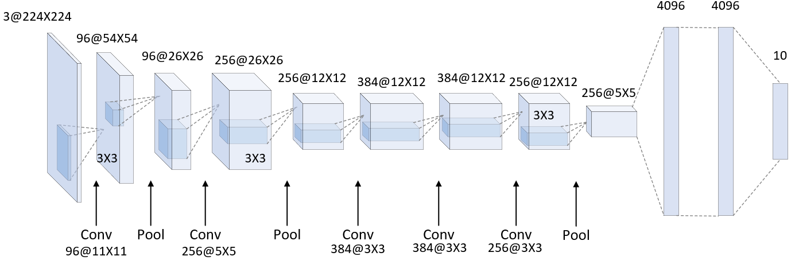

# AlexNet Classification on CIFAR10

#### AlexNet is a classical Convolutional Neural Network proposed by Alex Krizhevsky, Ilya Sutskever, and Geoffrey Hinton in the 2012 ImageNet. At that time, AlexNet achieved excellent results in the ImageNet large-scale visual recognition competition, raising the correctness of deep learning models in the competition to an unprecedented level.

* Deeper Architecture
* ReLU settle Gradient Vanishing
* Use Dropout

  

### Network Architecture Diagram

---

    Layer (type)               Output Shape         Param 

---

        Conv2d-1           [-1, 96, 54, 54]          34,944
          ReLU-2           [-1, 96, 54, 54]               0
     MaxPool2d-3           [-1, 96, 26, 26]               0
        Conv2d-4          [-1, 256, 26, 26]         614,656
          ReLU-5          [-1, 256, 26, 26]               0
     MaxPool2d-6          [-1, 256, 12, 12]               0
        Conv2d-7          [-1, 384, 12, 12]         885,120
          ReLU-8          [-1, 384, 12, 12]               0
        Conv2d-9          [-1, 384, 12, 12]       1,327,488
         ReLU-10          [-1, 384, 12, 12]               0
       Conv2d-11          [-1, 256, 12, 12]         884,992
         ReLU-12          [-1, 256, 12, 12]               0
    MaxPool2d-13            [-1, 256, 5, 5]               0
       Linear-14                 [-1, 4096]      26,218,496
         ReLU-15                 [-1, 4096]               0
      Dropout-16                 [-1, 4096]               0
       Linear-17                 [-1, 4096]      16,781,312
         ReLU-18                 [-1, 4096]               0
      Dropout-19                 [-1, 4096]               0
       Linear-20                   [-1, 10]          40,970
         ReLU-21                   [-1, 10]               0
---

    Total params: 46,787,978
    Trainable params: 46,787,978
    Non-trainable params: 0
-----------------------

    Input size (MB): 0.57
    Forward/backward pass size (MB): 10.17
    Params size (MB): 178.48
    Estimated Total Size (MB): 189.23
---------------------------------

    Pytorch Environment : 2.0.1+cu117
---------------------------------
